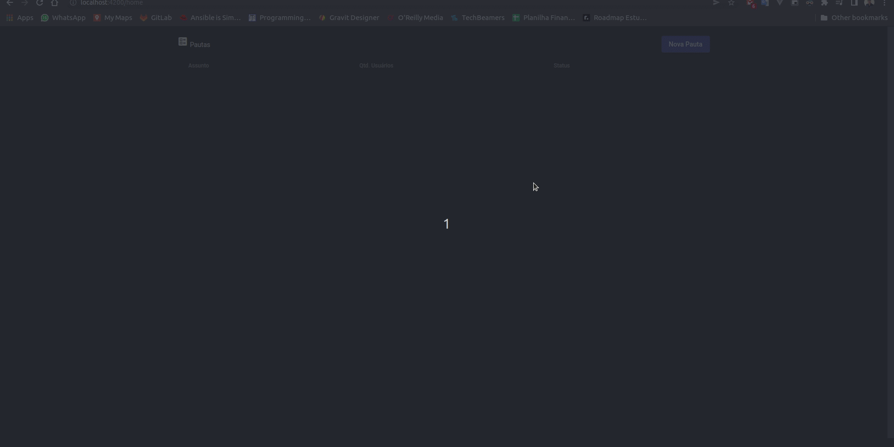

# Desafio técnico Backend -> Projecto: **Voting**
Um pequeno sistema de gerenciamento de Sessões de votação a uma determinada Pauta.


- [Desafio técnico Backend -> Projecto: **Voting**](#desafio-técnico-backend---projecto-voting)
  - [:hammer: Features](#hammer-features)
  - [Acesso ao projeto](#acesso-ao-projeto)
    - [Pré requisitos](#pré-requisitos)
    - [Rodando o projeto](#rodando-o-projeto)
    - [Documentação API](#documentação-api)
  - [:hammer_and_wrench: Tecnologias](#hammer_and_wrench-tecnologias)

:construction: Projeto em construção :construction: 

:warning: Devido não ter conseguido muito tempo para me dedicar ao projeto e a necessidade de entregá-lo para avaliação, existem alguns pontos que precisam ser melhorados!

## :hammer: Features
- [x] Lista Pautas cadastradas
- [x] Apresenta os votos de uma Pauta
- [x] Cria novas Pautas para votação
- [x] Cria novas sessões
- [x] Gerencia os votos da sessão

Também desenvolvi um pequeno [frontend](https://github.com/LHenriqueec/voting-front) para usar a api
<h1 align="center">
  </img>
<h1>

## Acesso ao projeto
### Pré requisitos
Antes de começas, você vai precisar ter instalado o [docker](https://docs.docker.com/get-docker/) e o [docker-compose](https://docs.docker.com/compose/install/)!

### Rodando o projeto
```bash
# Clone o repositório do projeto
git clone https://github.com/LHenriqueec/voting-backend.git

# Acesse a pasta do projeto
cd voting-backend

# Deixe o docker fazer a mágica
docker compose up

# O servidor iniciará na porta:8080 - acesse <localhost:8080>
```

### Documentação API
Você pode acessar a documentação do projeto no endereço [http://localhost:8080/swagger-ui.html](http://localhost:8080/swagger-ui.html)

## :hammer_and_wrench: Tecnologias
- [Java](https://www.oracle.com/java/technologies/downloads/)
- [Spring](https://spring.io/)
- [Mysql](https://www.mysql.com/)
- [RabbitMQ](https://www.rabbitmq.com/)

---
Made with :orange_heart: by LUIZ HENRIQUE E C LEITE :wave: [See my Linkedin](https://www.linkedin.com/in/lhenriqueec/)